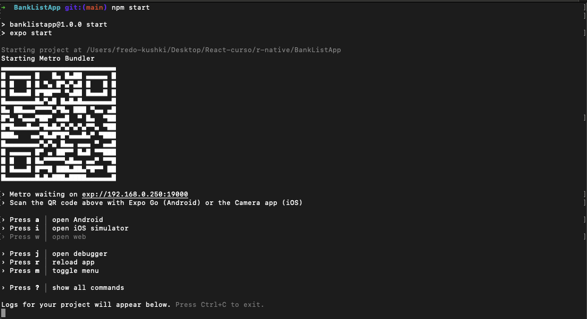

# BanksListApp

A continuación, te presento los pasos para poder ejecutar y visualizar esta app. Se utilizó Expo para realizar un desarrollo más rápido, con el cual se tienen facilidades para React Native.

El primer paso es clonar el proyecto y tenerlo en tu equipo local. Luego, desde tu consola, accede al proyecto y ejecuta el siguiente comando para instalar las dependencias necesarias:

```
npm install
```


La ventaja de desarrollar con estas tecnologías es que podemos levantar el proyecto sin necesidad de tener un IDE específico como Android Studio o Xcode.

Una vez que se hayan instalado todas las dependencias, ejecutamos el siguiente comando para levantar el servidor:

```
npm start
```
Este comando nos permite levantar el servidor y probar la app en cualquier plataforma, ya sea Android o iOS. Si quisieras ejecutar la aplicación desde alguno de los emuladores que contiene Android Studio o Xcode, puedes utilizar los siguientes comandos:

**Para Android:**

```
npm run android
```

**Para iOS:**
```
npm run ios
```

Una vez que el servidor se haya levantado, verás la consola de la siguiente manera. Esta te proporcionará un código QR para que puedas probar la aplicación utilizando la app de Expo Go en caso de que no utilices algún emulador en tu computadora. Con estos pasos, podrás ejecutar y visualizar la app en tu dispositivo móvil.




By Arlequin